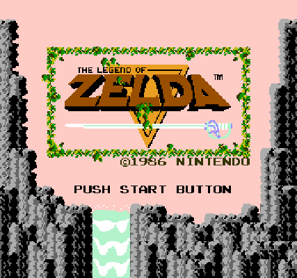

# NES Emulator

Tool for emulating the Nintendo Entertainment System with support for
recording GIFs, and saving and loading the game state.

Only supports the NROM and MMC1 mappers.

## Usage

```
Options:
    [-r, --rom-file PATH]               rom file (ines format) to load
    [-l, --load-state-file PATH]        state file to load
    [-a, --autosave-after-frames INT]
                save state after this many frames
    [-k, --kill-after-frames INT]       exit after this many frames
    [-f, --frame-duration-ms INT]       frame duration in milliseconds
    [-s, --save-state-file PATH]        state file to save
    [-g, --gif PATH]                    gif file to record
    [-n, --name-table-gif PATH]         gif file to record name tables into
    [-e, --headless-num-frames INT]     run with headless frontend, exiting after a specified number of frames
    [-d, --debug]                       enable debugging printouts
    [-p, --persistent-state-filename PATH]
                file to store persistent state
    [-z, --zoom FLOAT]                  real pixels per pixel (Default: 1)
    [-h, --help]                        print help message
```

## Example: Record a GIF of scrolling text at the start of Legend of Zelda

Start by making a save state at the begining of the scrolling text.
Run the emulator on a Legend of Zelda ROM, specifying a file to store the state.

```
cargo run -- --rom-file /path/to/zelda-rom.nes --save-state-file /tmp/zelda.sav
```

The game starts with a splash screen:



After about 15 seconds the splash screen will fade out to black, and shortly thereafter
the scrolling text will appear. Before the text appears, press `s` to record a save state,
then close the window.

The next step is to load the save state, specifying a GIF file to create:
```
cargo run -- --load-state-file /tmp/zelda.sav --gif /tmp/zelda-text.gif
```

Passing the ROM file isn't necessary this time, as the save state is a snapshot of the
entire machine's state, including the ROM data.

This will run the emulator as normal, starting from the point that the save state was
recorded, appending each frame to a GIF file. Close the emulator window to stop recording.

The result:


